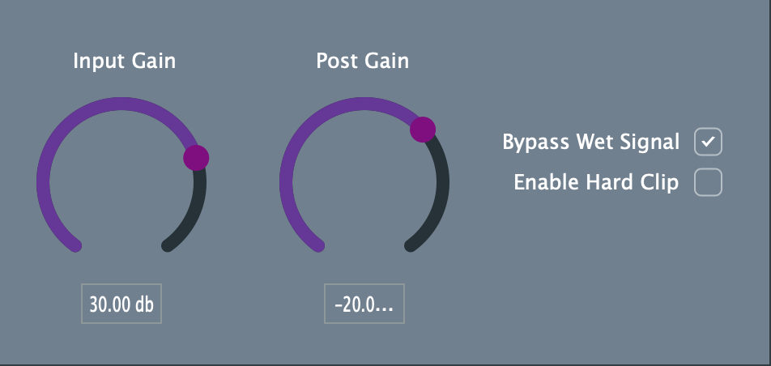

# Juce-Distortion-Plugin

## Overview
A distortion VST3 audio plugin created using the framework JUCE. The plugin has two distortion modes, soft clip and hard clip as well as a reverb feature.



## Setup

**Step 1:** Download the plugin [here](https://drive.google.com/file/d/15Gc-sDmHPXfhtqSMcFA_AmC4QGKXvjLv/view?usp=sharing).

**Step 2:** Place the VST3 file into the directory where your system stores VST3 audio plugins, on macOS this is in the directory ```/Library/Audio/Plug-Ins/VST3/```.

**Step 3** Download [JUCE](https://juce.com/get-juce/download), then run the ```AudioPluginHost.jucer``` which is in the directory ```JUCE/extras/AudioPluginHost/```. To test the plugin select ```options``` -> ```edit list of available plugins..``` -> ```options``` -> ```scan for new or updated VST3 plug-ins``` -> ```scan```. Alternatively, if you are familiar with DAWs you can test the plugin using your DAW. 
